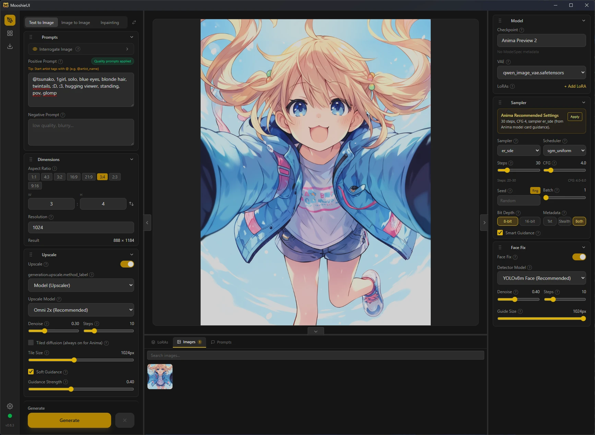

# MooshieUI

> ⚠️ **Work in Progress** — MooshieUI is under active development. Some features are incomplete or may have rough edges. Contributions and feedback are welcome!

A modern, beginner-friendly desktop frontend for [ComfyUI](https://github.com/comfyanonymous/ComfyUI). Built with **Svelte 5** + **Tauri** (Rust), MooshieUI hides ComfyUI's node-graph complexity behind a clean, intuitive interface — no workflow editing required.


<p align="center">
  
</p>



---

## ✨ Features

> Features marked with ✅ are implemented. Features marked with 🔧 work but need polish.

### 🎨 Three Generation Modes

| Mode | Status | Description |
|------|--------|-------------|
| **Text to Image** | ✅ | Generate images from scratch using positive & negative prompts |
| **Image to Image** | ✅ | Transform existing images with adjustable denoise strength |
| **Inpainting** | ✅ | Selectively edit parts of images using a built-in canvas editor with mask painting |

Switch between modes with a single click — all settings carry over.

### 🔧 Full Generation Controls

- **Positive & Negative Prompts** — Multi-line text areas, manually resizable height
- **Checkpoint Selector** — Searchable dropdown, auto-populated from ComfyUI, with recommended models (auto-download on selection with progress bars and file size display)
- **VAE Selector** — Optional override (defaults to checkpoint's built-in VAE)
- **LoRA Support** — Add unlimited LoRAs with independent model/CLIP strength sliders (0–2), per-LoRA enable/disable toggle, searchable dropdown, and active count badge
- **Sampler & Scheduler** — All ComfyUI samplers and schedulers available
- **Steps** — 1 to 150 (slider)
- **CFG Scale** — 0 to 30 with 0.1 precision (number input + slider)
- **Seed** — Fixed or random (-1 for new seed each generation)
- **Batch Size** — Generate 1–8 images per prompt
- **Denoise Strength** — 0 to 1 for img2img and inpainting modes

### 📐 Smart Dimension Controls

- **Aspect Ratio Presets** — 1:1, 4:3, 3:2, 16:9, 21:9, 3:4, 2:3, 9:16
- **Custom Aspect Ratio** — Enter any width/height, ratio is maintained when adjusting resolution
- **Swap Dimensions** — One-click width↔height swap
- **Resolution Slider** — 64px to 2048px, automatically calculates dimensions from your aspect ratio

### 🔍 Upscale (Tiled Diffusion)

Built-in upscaling with **MultiDiffusion** tiled diffusion — the same approach used by SwarmUI. No slow tile-by-tile processing; all tiles are denoised simultaneously each step for seamless, high-quality results.

#### Upscale Methods
- **Model-based** — Uses dedicated upscale models (e.g., Omni-SR). Scale is determined by the model (2x, 4x, etc.)
- **Algorithmic (Lanczos)** — Fast pixel-space upscaling with adjustable 1–4x scale

#### Recommended Models (Auto-Download)
When you select a recommended model that isn't installed, MooshieUI automatically downloads it to ComfyUI's `models/upscale_models/` directory:

| Model | Scale | Size | Source |
|-------|-------|------|--------|
| **Omni 2x** (Recommended) | 2x | ~1.6 MB | [Acly/Omni-SR](https://huggingface.co/Acly/Omni-SR) |
| **Omni 4x** (Recommended) | 4x | ~1.6 MB | [Acly/Omni-SR](https://huggingface.co/Acly/Omni-SR) |

Any other upscale models you place in `models/upscale_models/` will also appear in the dropdown.

#### Tiled Diffusion (Optional)
- Toggle on/off per generation — recommended for large images and **required for Anima (COSMOS) models**
- Adjustable tile size (256–2048px)
- Uses cosine-feathered blending for seamless tile boundaries
- Supports both **MultiDiffusion** and **SpotDiffusion** algorithms

#### Upscale Sampler Controls
- **Denoise** — 0 to 1 (lower = more detail preservation from original)
- **Steps** — 1 to 50

#### One-Click Upscale
Hover over any generated image to reveal an **Upscale** button — instantly upscale the last output without changing your settings.

### 🖼️ Gallery

- **Persistent Gallery** — All generated images are saved to disk and available across sessions
- **Thumbnail Grid** — Responsive grid with sorting by date
- **Lightbox** — Click any image to view full-size; scroll-wheel zoom at cursor, Escape or click-outside to close, double-click to reset zoom
- **Image Management** — Rename, delete, copy to clipboard, and upscale from the gallery
- **Generation Mode Labels** — Each image shows whether it was created via txt2img, img2img, or inpainting

### 📊 Real-Time Progress

- **Live Preview** — See the image as it's being generated (latent previews streamed via WebSocket)
- **Phase Labels** — "Generating...", "Upscaling...", or "Preparing..." with step counter
- **Progress Bar** — Smooth animated bar (indigo for generation, emerald for upscale pass)
- **Cancel Button** — Interrupt any generation in progress

### 💾 Settings Persistence

All settings are automatically saved to disk and restored on next launch:
- Generation mode, prompts, model selections
- Sampler, scheduler, steps, CFG, seed, dimensions
- All upscale settings (enabled, method, model, tiling, etc.)

### 🖥️ Flexible Layout

- **Three-panel layout** — Image settings (left), preview (center), model & sampler settings (right)
- **Resizable panels** — Drag dividers between panels to adjust widths
- **Resizable prompts** — Drag prompt text areas to adjust height

### 🔌 Connection Management

- **Auto-connect** to ComfyUI on startup
- **Status indicator** — Green/red dot shows connection state with version number
- **WebSocket streaming** — Real-time progress, previews, and completion events
- Works with both local and remote ComfyUI instances
- **Silent background process** — ComfyUI runs without any visible terminal windows (Windows)

### 🧬 Smart Model Detection

- **Hash-based identification** — Models are recognized by SHA256 hash (CivitAI AutoV2 format), not just filename — renamed files are still detected
- **CivitAI integration** — Look up any model's metadata (name, version, preview images) via CivitAI's hash database
- **Recommended models** — SIH-1.5 (~7.5 GB) and Anima Preview 2 (~13 GB) auto-download on selection with real-time progress bars and file size display

---

## 🏗️ Architecture

```
MooshieUI
├── src/                    # Svelte 5 frontend (UI)
│   ├── App.svelte          # Main app shell, gallery, WebSocket listeners
│   ├── lib/
│   │   ├── components/     # UI components
│   │   │   ├── generation/ # Model selector, prompts, dimensions, upscale
│   │   │   ├── canvas/     # Inpainting canvas editor (WIP)
│   │   │   ├── progress/   # Live preview and progress display
│   │   │   ├── setup/      # Setup wizard with streaming installer
│   │   │   └── ui/         # Shared UI components (tooltips, etc.)
│   │   ├── stores/         # Svelte 5 rune-based state ($state, $derived)
│   │   ├── types/          # TypeScript interfaces
│   │   └── utils/          # Tauri API bridge (models, gallery, hashing, CivitAI)
├── src-tauri/              # Rust/Tauri backend
│   └── src/
│       ├── commands/       # Tauri command handlers (API, config, server, WebSocket)
│       ├── comfyui/        # ComfyUI API client, WebSocket, process management
│       ├── setup.rs        # One-click installer (uv, Python, ComfyUI, PyTorch)
│       └── templates/      # Workflow builders (txt2img, img2img, inpainting, upscale)
└── comfyui-nodes/          # Custom ComfyUI nodes (install into comfy_extras/)
    └── nodes_tiled_diffusion.py
```

**How it works:**
1. User adjusts settings in the Svelte UI
2. On "Generate", settings are sent to the Rust backend via Tauri `invoke()`
3. Rust builds a ComfyUI workflow JSON from templates (no node graph exposed)
4. Workflow is submitted to ComfyUI's `/prompt` API
5. WebSocket streams progress/previews back to the UI in real-time

---

## 📦 Installation

### One-Click Setup (Windows/Linux Releases)

MooshieUI handles everything automatically on first launch:

1. **Download** a release from [Releases](https://github.com/Mooshieblob1/MooshieUI/releases) (Windows/Linux artifacts)
2. **Run the app** — the setup wizard will:
  - Download [uv](https://github.com/astral-sh/uv) (fast Python package manager)
  - Install Python 3.11 (isolated, won't affect your system)
  - Download ComfyUI (latest from GitHub)
  - Create a virtual environment
  - Auto-detect your GPU (NVIDIA CUDA / AMD ROCm / CPU)
  - Install PyTorch with the right acceleration backend
  - Install all ComfyUI dependencies
  - Install MooshieUI's custom nodes
3. **Start generating** — ComfyUI launches automatically

The installer shows real-time terminal output streamed as a matrix-style backdrop behind the setup UI, with per-step progress bars and a checklist so you always know what's happening. No separate terminal windows are opened.

**No Python, no pip, no manual configuration required.** Everything is self-contained in the app's data directory.

> **Disk space:** ~5–10 GB (Python + PyTorch + ComfyUI). Installation takes 5–15 minutes depending on your internet connection.

### macOS (Manual Build From Source)

macOS prebuilt release artifacts are currently disabled. On macOS, use a source build:

**Prerequisites:**
- [Node.js](https://nodejs.org/) 18+
- [Rust](https://rustup.rs/) (latest stable)
- Xcode Command Line Tools (`xcode-select --install`)
- Tauri prerequisites — see [Tauri v2 docs](https://v2.tauri.app/start/prerequisites/)

```bash
# Clone the repository
git clone https://github.com/Mooshieblob1/MooshieUI.git
cd MooshieUI

# Install dependencies
npm install

# Development mode
npm run tauri dev

# Production build
npm run tauri build
```

After first launch, the setup wizard still installs ComfyUI/Python/PyTorch automatically.

### Development Setup (All Platforms)

If you want to build from source:

**Prerequisites:**
- [Node.js](https://nodejs.org/) 18+
- [Rust](https://rustup.rs/) (latest stable)
- Tauri prerequisites — see [Tauri v2 docs](https://v2.tauri.app/start/prerequisites/)

```bash
# Clone the repository
git clone https://github.com/Mooshieblob1/MooshieUI.git
cd MooshieUI

# Install frontend dependencies
npm install

# Run in development mode (hot-reload)
npm run tauri dev

# Build for production
npm run tauri build
```

The app will run the one-click setup wizard on first launch — no manual ComfyUI installation needed.

---

## 🧩 Custom Node: Tiled Diffusion

MooshieUI ships with a custom ComfyUI node (`nodes_tiled_diffusion.py`) that implements:

### MultiDiffusion
*Bar-Tal et al., "MultiDiffusion: Fusing Diffusion Paths for Controlled Image Generation", ICML 2023*

- Splits the latent into overlapping tiles at each denoising step
- All tiles are denoised in parallel (not one-by-one)
- Results are blended using cosine (Hann window) feathering
- Seamless output with no visible tile boundaries

### SpotDiffusion
*Ding et al., 2024*

- Applies random circular shifts before non-overlapping tiling
- Even faster than MultiDiffusion (no overlap computation)
- Seams are eliminated by randomization across many steps

Both methods:
- Work with all model architectures (SD 1.5, SDXL, Flux, COSMOS/Anima)
- Automatically detect the model's latent downscale ratio
- Support ControlNet (proportional cropping/shifting per tile)
- Handle inpainting conditioning (c_concat)

---

## 🚧 Roadmap

### Done
- [x] **Image upload** for img2img and inpainting modes
- [x] **Inpainting canvas** — paint masks directly on images in the UI
- [x] **Queue management page** — view and cancel queued generations
- [x] **Settings page** — configure ComfyUI connection, paths, defaults, and extra args
- [x] **Gallery upscale button** — upscale any image from the gallery grid or lightbox
- [x] **Anima Preview 2 support** — auto-download split model (diffusion + CLIP + VAE), quality prompt injection, optimized defaults
- [x] **SIH-1.5 support** — auto-download checkpoint + VAE on selection, with file size display
- [x] **CFG++ auto-detect** — soft-sets CFG to 1.4 when selecting CFG++ samplers
- [x] **Info tooltips** — hover (?) icons explain technical settings in plain English
- [x] **Collapsible settings sections** — with search bar to filter settings
- [x] **Live generation preview** — latent previews streamed via WebSocket during KSampler
- [x] **Phase-aware progress** — shows "Generating..." / "Upscaling..." / "Preparing..." with step counters
- [x] **5D latent tiled diffusion** — MultiDiffusion/SpotDiffusion compatible with Anima (COSMOS) models
- [x] **Lightbox zoom & dismiss** — scroll-wheel zoom at cursor, Escape/click-outside to close, pan with left or middle mouse
- [x] **Clipboard copy as file** — copies gallery images as file references (preserves format & metadata)
- [x] **Windows & Linux builds** — cross-platform CI releases (Windows .msi/.exe, Linux .deb/.AppImage)
- [x] **Hash-based model detection** — SHA256/AutoV2 hash identification with CivitAI API integration, models recognized even if renamed
- [x] **Installer UX overhaul** — streamed terminal backdrop, per-step progress bars, download progress with bytes/total, no separate terminal windows
- [x] **Persistent gallery** — images saved to disk across sessions with rename, delete, and management
- [x] **Gallery boards** — organize images into named boards/folders
- [x] **Version display** — app version shown in sidebar below connection status
- [x] **Download progress** — real-time progress bars with file size for all model downloads (checkpoints, VAEs, upscale models)
- [x] **Drag & drop** — drop images and masks directly into img2img/inpainting inputs
- [x] **Image metadata (SwarmUI-compatible)** — embed generation params as SwarmUI JSON into PNG text chunks, read them in lightbox with resizable side panel, backward-compatible with A1111 format
- [x] **Prompt history & favorites** — auto-saves generated prompts with quick reload and starring
- [x] **Style presets (Fooocus-style)** — one-click style modifiers for beginner-friendly prompting
- [x] **Shared model directory** — point to an external/shared models folder from settings
- [x] **Model-specific presets** — auto-applies defaults based on detected model architecture
- [x] **Model Hub** — browse CivitAI models with image previews and metadata directly in the app; download with one click; HuggingFace direct URL support; NSFW content filtering with blurred badges; API key setup with guided instructions; expanded base model filters (NoobAI, Pony, Illustrious, SD 3.5, Flux, etc.)
- [x] **ModelSpec support** — reads Stability AI ModelSpec metadata from safetensors headers; displays model title, author, architecture, resolution, trigger phrases (click to add to prompt), tags, and usage hints in the model selector
- [x] **Native clipboard** — copies images via native OS clipboard (Wayland `wl-copy` and X11 `xclip` with automatic detection)
- [x] **Auto-update** — check for and apply MooshieUI updates in-app
- [x] **ControlNet support** — depth, canny, pose, and other control methods with preset-based and custom modes, image upload/paste/drag-drop, preprocessor installation, strength/start/end controls (SD 1.5, SDXL, Illustrious/NoobAI — not available for Anima/COSMOS models)
- [x] **Dark & light mode** — toggle between dark and light themes in settings
- [x] **Draggable two-column layout** — drag sections between left/right columns and reorder them; layout persists across sessions
- [x] **Manual ComfyUI start** — optional toggle to start ComfyUI manually instead of on app launch
- [x] **Movable installation** — relocate the ComfyUI data directory to another drive from settings
- [x] **Face Fix (FaceDetailer)** — built-in lightweight face detection and re-denoising using YOLOv8, bundled as a custom node (no Impact Pack dependency); configurable denoise, steps, guide size, and detector model with auto-download
- [x] **Batch queue** — queue multiple generations with different settings
- [x] **Streaming final outputs** — final PNGs stream over WebSocket via `MooshieSaveImage` (no output fetch disk round-trip)
- [x] **16-bit output mode** — selectable 8-bit/16-bit PNG output in generation settings
- [x] **Metadata modes** — `Text Chunk`, `Stealth Alpha`, and `Both` with 16-bit compatibility upgrade to `Both`
- [x] **Metadata reuse actions** — lightbox actions for `Reuse Settings`, `Remix`, and `Reuse Seed`
- [x] **Preview tips carousel** — idle preview area shows rotating, auto-cycling tips with manual navigation
- [x] **Metadata drag-and-drop import** — drag images onto generation sections to import specific settings, or drop on preview to apply all; Ctrl+V paste supported; auto-strips duplicate quality tags
- [x] **Face fix auto-setup** — auto-downloads detection model and installs ultralytics on first use
- [x] **Seed recall** — toggling off random seed recalls the last generated seed

### To Do
- [ ] **Theme customization** — custom accent colors and themes
- [ ] **Localization** — multi-language support
- [ ] **Video generation** — AnimateDiff / COSMOS video workflows
- [ ] **Training UI** — LoRA training from within the app
- [ ] **Plugin system** — extend MooshieUI with custom panels and features
- [ ] **Cloud rendering** — option to offload generation to remote GPUs
- [ ] **PWA Support** — allowing users to host their own instances of MooshieUI to present as a webapp

---

## 📋 Changelog

See [CHANGELOG.md](CHANGELOG.md) for the full version history.

---

## ️ Tech Stack

| Layer | Technology |
|-------|------------|
| Frontend | Svelte 5, TypeScript, Tailwind CSS 4 |
| Desktop | Tauri v2 (Rust) |
| State | Svelte 5 runes (`$state`, `$derived`) |
| Persistence | `@tauri-apps/plugin-store`, localStorage |
| Backend API | ComfyUI REST + WebSocket |
| Model API | CivitAI REST API (hash-based model lookup) |
| Styling | Tailwind CSS with neutral/indigo theme |

---

## 🔒 Security

This repository runs automated **GlassWorm resistance checks** on every push and pull request to detect a class of supply-chain attacks that use invisible Unicode variation-selector characters to embed hidden payloads in source files, combined with force-pushed commits whose author/committer timestamps have been tampered with to conceal the injection.

### What is checked

| Check | Scope | Details |
|-------|-------|---------|
| Marker variable | Full repo | Detects the known GlassWorm beacon string |
| Unicode steganography | `.py .js .ts .svelte .rs` | Scans for codepoints U+FE00–FE0F and U+E0100–E01EF (zero-width variation selectors used to encode payloads) |
| Git date tampering | Full history | Flags any commit where the committer timestamp is more than 1 hour ahead of the author timestamp — a sign of force-pushed history rewriting |
| Obfuscated `eval()` | `.py .js .ts .svelte` | Detects `eval()` calls whose argument contains `decode`, `atob`, `fromCharCode`, `Buffer.from`, or `base64` — the execution pattern used by the Unicode loader |

The CI workflow (`.github/workflows/glassworm-scan.yml`) runs all four checks and **blocks merges** if any check fails.

### Local pre-commit hook

Contributors should activate the same checks locally so issues are caught before they reach CI:

```bash
bash scripts/setup-hooks.sh
```

This sets `core.hooksPath` to `.githooks` and makes the pre-commit script executable. The hook runs automatically on every `git commit` and blocks the commit with a clear error message if anything suspicious is found.

---

## 📄 License

This project is licensed under the [MIT License](LICENSE).

---

## 🙏 Acknowledgments

- [ComfyUI](https://github.com/comfyanonymous/ComfyUI) — The powerful node-based backend
- [Tauri](https://tauri.app/) — Lightweight desktop app framework
- [Svelte](https://svelte.dev/) — Reactive UI framework
- [CivitAI](https://civitai.com/) — Model hash database and API
- [OmniSR](https://huggingface.co/Acly/Omni-SR) — Recommended upscale models by Acly
- MultiDiffusion paper — Tiled diffusion algorithm
- SpotDiffusion paper — Fast tiled diffusion variant
